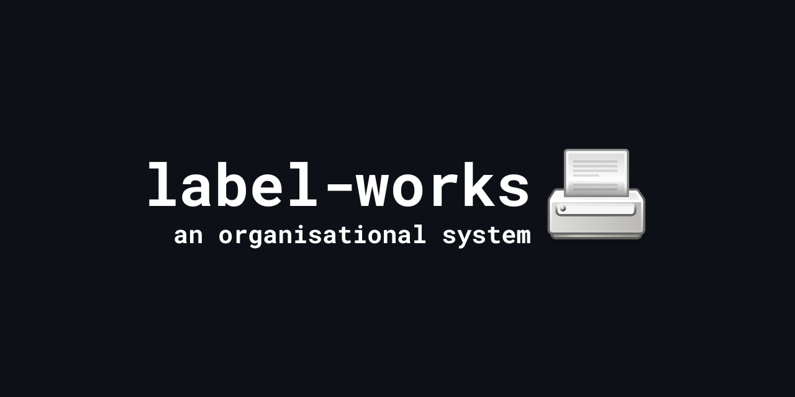
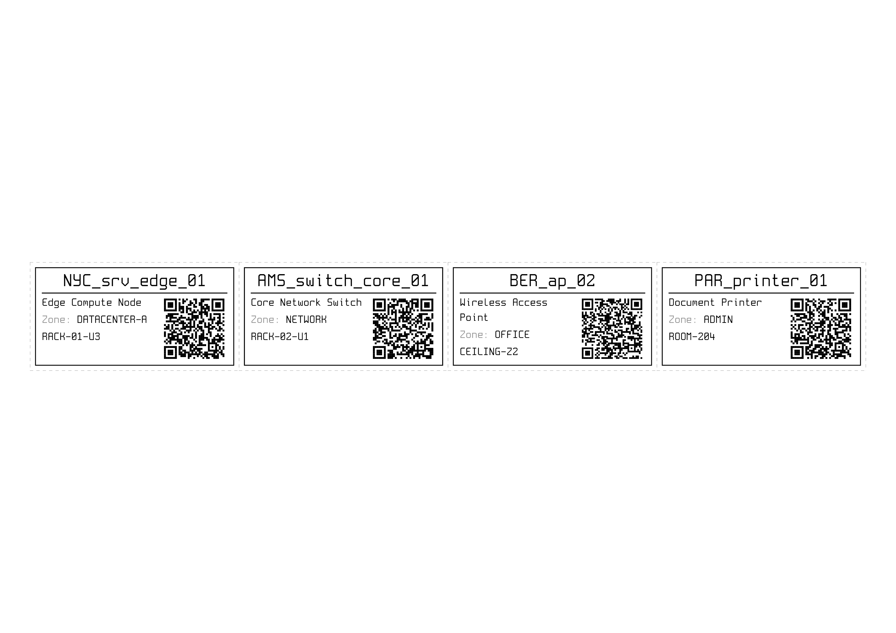

## Technical Details
Coded in:
- Typst (using [cades](https://typst.app/universe/package/cades/) package)
- JSON

## Dependencies
- Typst
- `Spleen 32x64` Font (found in [fcambus/spleen](https://github.com/fcambus/spleen/releases))

## Project Goals
- Track techincal details
- Track changes
- Provide documentation
- Give each item with a label an individual identifier

## How does it work?
Each label is rendered with 4 fields and a QR-Code (optionally disabled per label). QR codes could lead to:
- Repairs & Replacement Logs
- Internal Documentation
- Dashboards
- etc...

## How do you use it?
1. Install the `Spleen 32x64` font to your system using the file [provided](https://github.com/p-i-c-o/label-works/raw/refs/heads/main/spleen-32x64.otf).
2. Configure the `labels.json` file to specify your items and your documentation base URL.
3. Render your labels using `typst compile labels.typ`
4. Print the `labels.pdf` file on to sticker A4 paper.
5. Cut on dashed-lines and apply!

## How do you configure it?

Create and edit a `labels.json` file to include a list containing a `"base-url`" text-field and an `"items"` list with each label, each label item has:

| Field | What is it? | Example | URL Placeholder | Required |
|----------------|----------------------|--------|--------|--------|
| `id` | Item ID | `NYC_srv_edge_01` | `%id%` | Yes |
| `name` | Description | `Edge Compute Node` | `%name%` | Yes |
| `zone` | Zone | `DATACENTER-A` | `%zone%` | Yes |
| `locator` | Locator | `RACK-01-U3` | `%locator%` | Yes |
| `url` | Override URL | `http://10.0.20.134:8005` |  | No |
| `qr` | Show QR code | `false` |  | No |

The `base-url` and per-item `url` can include `%id%`, `%locator%`, `%name%`, or `%zone%` placeholders which will be substituted in the QR code URL. If the `base-url` contains no placeholders, `%id%` will be appended automatically for backward compatibility. Both `base-url` and item-level `url` support URL placeholders. Item-level `url` takes precedence over `base-url` for that specific label. You can also manually disable the QR code per individual label using the `qr` boolean field.


## Example JSON Configuration
```json
{
  "base-url": "https://docs.example.com/items/%zone%/%id%",
  "items": [
    {
      "id": "NYC_srv_edge_01",
      "name": "Edge Compute Node",
      "zone": "DATACENTER-A",
      "locator": "RACK-01-U3"
    },
    {
      "id": "AMS_switch_core_01",
      "name": "Core Control Network Switch",
      "zone": "NETWORK",
      "locator": "RACK-02-U1",
      "qr": false
    },
    {
      "id": "BER_ap_02",
      "name": "Wireless Access Point",
      "zone": "OFFICE",
      "locator": "CEILING-Z2",
      "url": "https://docs.example.com/wifi/%locator%/%name%"
    },
    {
      "id": "PAR_printer_01",
      "name": "Document Printer",
      "zone": "ADMIN",
      "locator": "ROOM-204",
      "url": "https://docs.example.com/printers/%locator%/%id%",
      "qr": false
    }
  ]
}
```


Would render:



## To-Do
- [X] Implement QR code URL override
- [X] Implement QR code disable
- [ ] Code simple item management script
